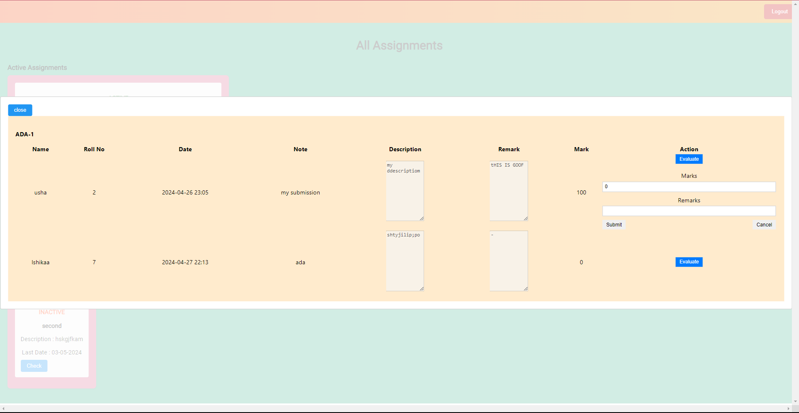
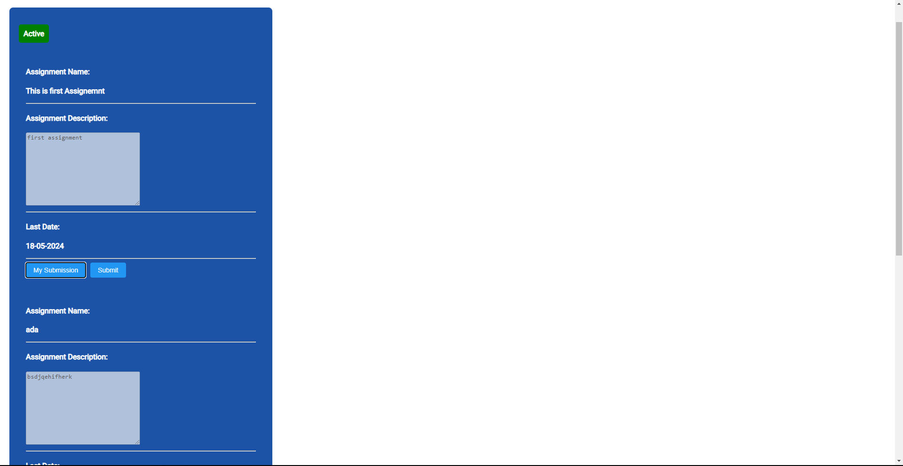
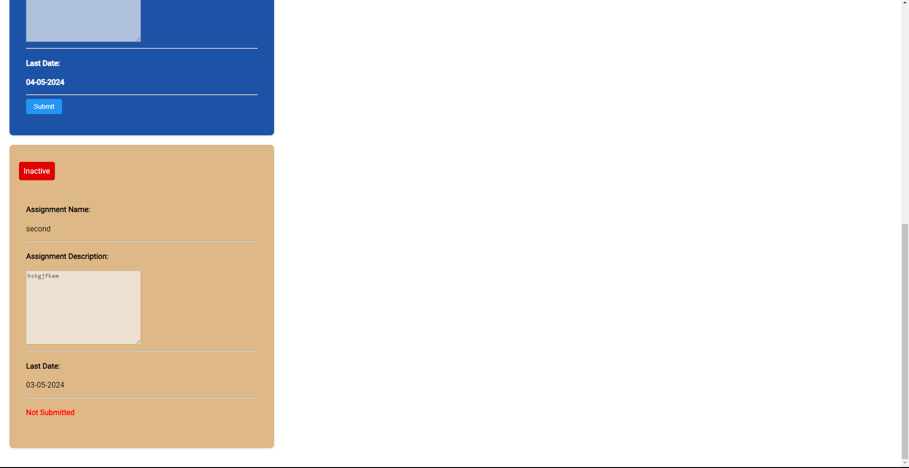

# Assignment Management System for Baba Institute of Technology and Science, Vishakhapatnam
## Overview
This project is an Assignment Management System designed for academic institutions, specifically tailored for Baba Institute of Technology and Science in Vishakhapatnam. The system consists of three portals: Admin, Faculty, and Student, each with distinct functionalities to manage assignments efficiently.

## Technologies Used
- __Frontend__ : _React, HTML, CSS, JavaScript, Redux (with Redux Persist for state persistence)_
- __Database__ : _Firebase Realtime Database_
- __Authentication__ : _Firebase Authentication_
- __Hosting Platform__ : _Netlify_
- __IDE__ : _Visual Studio Code_

## Features by Portal

1. ### Admin Portal
- __Admin Signup__ : Admins can register using their email, name, password, and stream (branch). Information is saved in Firebase Realtime Database.

- __Faculty Signup__ : Admins can register faculty members with email, password, and name, assigning them to specific branches.

- __Student Signup__ : Admins can register students for each semester and branch.

- __Promote Students__ : Admins can promote students to the next semester based on exam results.

- __Add Subjects__ : Admins can add subjects to respective branches.

- __Map Subjects__ : Admins can assign faculty to teach specific subjects across different semesters.

2. ### Faculty Portal
- __Subject Management__ : Faculty can view and manage subjects assigned to them.
- __Create Assignment__ : Faculty can create assignments by providing submission dates, titles, and descriptions.
- __Check Assignments__ : Faculty can view active and inactive assignments, evaluate submissions, and provide feedback and marks.
- __Student List__ : Faculty can view a list of students in their branch and their assignment submissions.

3. ### Student Portal
- __Subject View__: Students can view subjects assigned to them for the current semester.
- __Assignment Submission__: Students can submit assignments for active subjects, view feedback and marks for inactive assignments.
- __View Assignments__ : Students can view details of assignments, including submission status and faculty feedback.
## Database Structure
The Firebase Realtime Database is structured to store:

- Admin, faculty, and student information.
- Branch-wise subjects and faculty assignments.
- Assignment details, including submissions and evaluations.
## Deployment and State Management
The project is deployed on Netlify for hosting. Redux with Redux Persist is utilized for state management, ensuring that user sessions and data persist across page reloads.

## Git Repository
The Git repository for this project contains the source code, detailed documentation, and setup instructions for better understanding and replication of the system.

## ScreenShots
__Main Page__

### Admin Portal 
__Admin Signup__

__Admin Login__

__Admin Home__

__Faculty SignUp__

__Student Signup__

__Promote Students__

__Add Subjects__

__Map Subjects__

__Promote Students__

### Faculty Portal 

__Faculty Login__

__Faculty Subjects Choosing__

__Faculty Home__

__Create Assignment__

__Check Assignment__

__Evaluation__

__Close Assignment__

__Student List__

### Student Portal

__Student Login__

__Student Subjects__

__Active Assignments__

__Inactive Assignments__

__Submit Assignments__

__Review Assignment__
